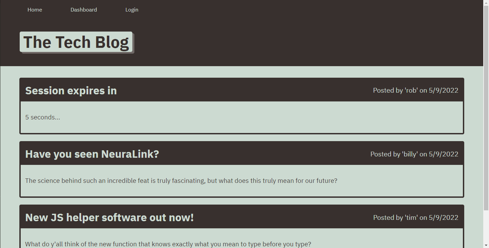
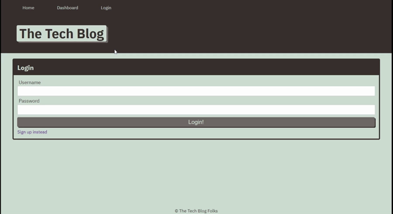

# Tech Blog

## Description
A simple full stack web application designed to create postings and add comments through user login and identification    

 ## Table of Contents:

  **[How to Use](#how-to-use)**  
  **[Application Demos](#application-demos)**  
  **[Link to Deployed Page](#link-to-deployed-page)**  
  **[References](#references)**  
  **[Devlopment Process](#development-process)**  
  **[Author](#author)**  

## How to Use:
* View postings on the main page of the website
* Click on posting headers to see user's comments
* If you want to add your own comments or make your own posts, you will need to login 
* If you do not have a login click the sign up link and it will direct you to create a user account
* To add a post, go into your dashboard and select "+ Post"
* To delete or update your post, go into your dash board and click the title of that post. Then fill out the form as desired
* To comment, go to the homepage and click on the post you would like to comment on. You can add your comment using the form towards the bottom
* Your session will expire after 5 minutes, login again if this happens

## Application Demos:
<h2 align="center">Homepage</h2>

   
<h2 align="center">Session Expiration</h2>

  

<a href="https://drive.google.com/file/d/1U-1swBech54cXyp0kz1k_hjd7ZzuixeY/view">Video Demo</a>

## Link to Deployed Page:

## References:
* Starter code given by Instructor from UTA Bootcamp
* Inspired by code from UTA Bootcamp: #14 MVC

## Development Process:
1. Set up base files
2. Removed all instances for need of login/user and authorization middleware
3. Began with the pilar of content (Post), and added/debugged out-branching featurers from there 
5. Ensured all pages displayed and ran as intended
4. Reintroduced login/user and authorization middleware
6. Confirmed session/userId tracking and data application
7. See commits for more details

## Author:
Created by Timothy Zalewski | Deployed on [GitHub](https://github.com/Tim-Zebra)